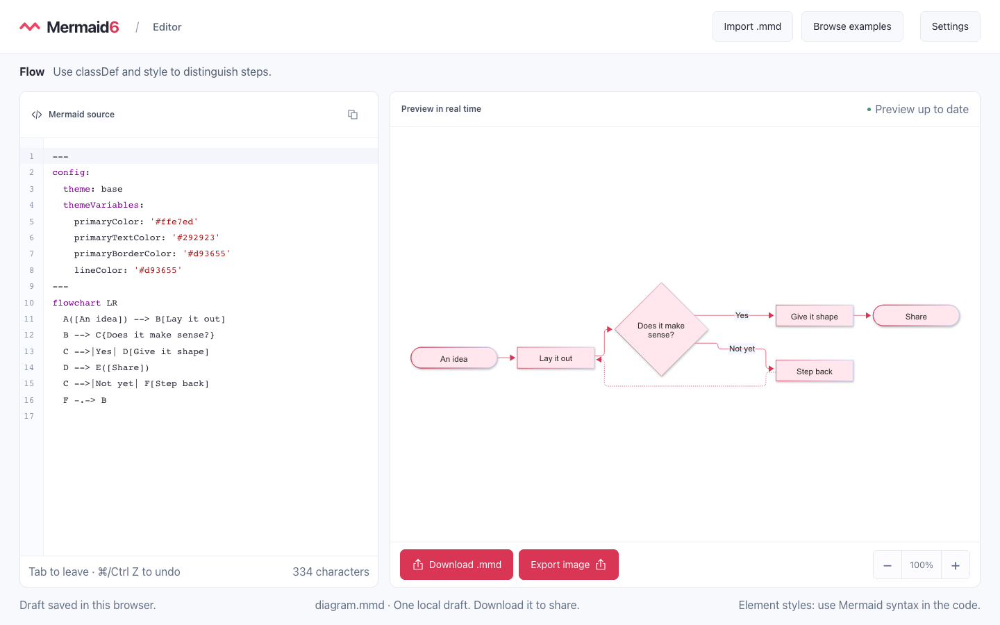

# Mermaid6

[](LICENSE)
[](https://github.com/renalddubus/mermaid6/actions/workflows/ci.yml)


**Mermaid6 is an open-source, browser-based editor for creating, previewing, and exporting [Mermaid](https://mermaid.js.org/) diagrams.**

Write Mermaid syntax with CodeMirror, see the result update in real time, explore a catalogue of ready-to-edit examples, and export the finished diagram without sending its source to a server.



## What Mermaid6 offers

- A live Mermaid 12 editor with syntax highlighting and useful error feedback.
- A catalogue of 35 editable examples covering flowcharts, sequences, states, classes, ER diagrams, journeys, timelines, and more.
- SVG and PNG image export at multiple resolutions, with white, dark, transparent, or custom backgrounds.
- `.mmd` file import and download while preserving the original filename.
- Automatic local draft recovery through IndexedDB.
- Light and dark themes.
- An interface available in English, French, Spanish, and German.
- Responsive keyboard-accessible layouts for desktop and mobile.
- A self-contained frontend: no account or application backend is required.

## Start development

### Requirements

- [Node.js 24](https://nodejs.org/) (the expected version is recorded in `.node-version`)
- npm

### Run locally

```sh
npm ci
npm run dev
```

Open [http://localhost:5173](http://localhost:5173).

### Useful commands

| Command                | Purpose                                                 |
| ---------------------- | ------------------------------------------------------- |
| `npm run dev`          | Start the Vite development server                       |
| `npm run check`        | Check formatting, lint, types, and the production build |
| `npm run format`       | Format the repository with Prettier                     |
| `npm run build`        | Type-check and create the production build              |
| `npm test`             | Run the Playwright browser test suite                   |
| `npm run test:release` | Validate release metadata and generated artifacts       |

Install Chromium once before running the browser tests:

```sh
npx playwright install chromium
```

On Linux, Playwright may also need its system packages:

```sh
npx playwright install --with-deps chromium
```

## Run with Docker

Docker Compose can build and start the same production application locally:

```sh
docker compose up --build --wait
```

Open [http://localhost:8080](http://localhost:8080). To use another local port:

```sh
MERMAID6_PORT=8081 docker compose up --build --wait
```

Stop the application with `docker compose down`. See the [release and container guide](docs/releases.md) to install a published image, verify a release, update, or roll back.

## Privacy and limits

Diagram rendering, image export, preferences, and draft storage happen in the browser. Mermaid6 does not require an account and does not upload diagram source to an application server.

Imported `.mmd` files must be UTF-8 text, no larger than 200 KB, and no longer than 50,000 characters. PNG exports are limited to 16,384 pixels per side and 32 million pixels in total; SVG is the better choice for very large diagrams. External resources embedded in a diagram are not exported.

## Contributing

Contributions are welcome. Read the [contribution guide](docs/CONTRIBUTING.md) for the development workflow, project structure, test expectations, translation guidance, and pull request checklist.

Helpful project documentation:

- [Diagram catalogue and rendering notes](docs/diagrammes.md) (French)
- [Interface translation guide](docs/strings.md)
- [Release and container guide](docs/releases.md)

## Developed with AI

Mermaid6 has been developed with AI assistance under human direction and review. AI-supported contributions are welcome, but contributors remain responsible for understanding, testing, licensing, and explaining everything they submit.

## License

Mermaid6 is available under the [MIT License](LICENSE).
